# `특강신청서비스`
## 설명
- 특강을 신청할 수 있는 서비스 개발
- RDBMS를 이용
- 각 기능 및 제약 사항에 대해 단위 테스트를 반드시 하나 이상 작성하도록 합니다.
- 다수의 인스턴스로 어플리케이션이 동작하더라도 기능에 문제가 없도록 작성하도록 합니다.
- 동시성 이슈를 고려하여 구현합니다.

# 요구사항 분석

- 특강선택 신청 API
  - `사용자아이디`와 `선택날짜`로 선착순으로 제공되는 특강을 신청하는 API 를 작성합니다.
  - 신청자는 `날짜별로` 특강을 신청합니다.
  - 해당날짜에 특강을 선택해서 특강을 신청할 수 있습니다.
  - ~~특강은 `4월 20일 토요일 1시` 에 열리며, 선착순 30명만 신청 가능합니다.~~
  - 신청자가 30명 초과라면 신청자는 특강을 신청할 수 없습니다.
  - 신청자가 30명 이하라면 특강신청정보에 저장됩니다.
  - 동일한 신청자는 한 번의 수강 신청만 성공할 수 있습니다.
  - 특강 신청자 수가 최대 정원에 도달했는지를 확인하고, 정원 미달인 경우에만 신청을 허용하는 로직을 구현할 때, 트랜잭션을 사용
  - 이미 신청자가 30명이 초과되면 이후 신청자는 요청을 실패합니다.
  - 정확하게 30 명의 사용자에게만 특강을 제공할 방법을 고민해 봅니다.
- 특강 신청 완료 여부 조회 API
  - 사용자아이디와 특강날짜 로 특강 신청 완료 여부를 조회하는 API 를 작성합니다.
  - 특강 신청에 성공한 사용자는 성공했음을, 특강 등록자 명단에 없는 사용자는 실패했음을 반환합니다.

- 특강신청 API
  - 특강의 정원은 30명으로 고정이다.

- 특강목록 조회 API
  - 사용자는 각 특강에 신청하기전 목록을 조회해볼 수 있어야 합니다.

- 특강신청자 목록조회 API

# ERD-MYSQL

- 특강신청정보 DDL
```sql
CREATE TABLE IF NOT EXISTS special_lecture_apply_info (
    `special_lecture_apply_id` BIGINT NOT NULL AUTO_INCREMENT COMMENT '인조키',
    `special_lecture_id` BIGINT NOT NULL COMMENT '특강 ID',
    `special_lecture_date` DATE NOT NULL COMMENT '특강 날짜',
    `user_id` VARCHAR(255) NOT NULL COMMENT '사용자 ID',
    UNIQUE KEY `unique_user_per_lecture` (`special_lecture_date`, `user_id`),
    PRIMARY KEY (`special_lecture_apply_id`),
    FOREIGN KEY (`special_lecture_id`) REFERENCES special_lecture_info(`special_lecture_id`)
    ON DELETE CASCADE
) ENGINE=InnoDB DEFAULT CHARSET=utf8mb4 COMMENT='특강신청정보';
```
- 특강정보 DDL
```sql
CREATE TABLE IF NOT EXISTS special_lecture_info (
    `special_lecture_id` BIGINT NOT NULL AUTO_INCREMENT COMMENT '인조키',
    `special_lecture_date` DATE NOT NULL COMMENT '특강 날짜',
    `max_capacity` INT NOT NULL DEFAULT 30 COMMENT '최대 정원',
    `current_applications` INT NOT NULL DEFAULT 0 COMMENT '현재 신청 수',
    PRIMARY KEY (`special_lecture_id`),
  UNIQUE KEY `unique_date` (`special_lecture_date`)
  ) ENGINE=InnoDB DEFAULT CHARSET=utf8mb4 COMMENT='특강정보';
```


# 고려사항
- 같은 사용자에게 여러 번의 특강 슬롯이 제공되지 않도록 제한할 방법을 고민해 봅니다.
  - 슬롯????


# 특강 레이어드 아키텍처

