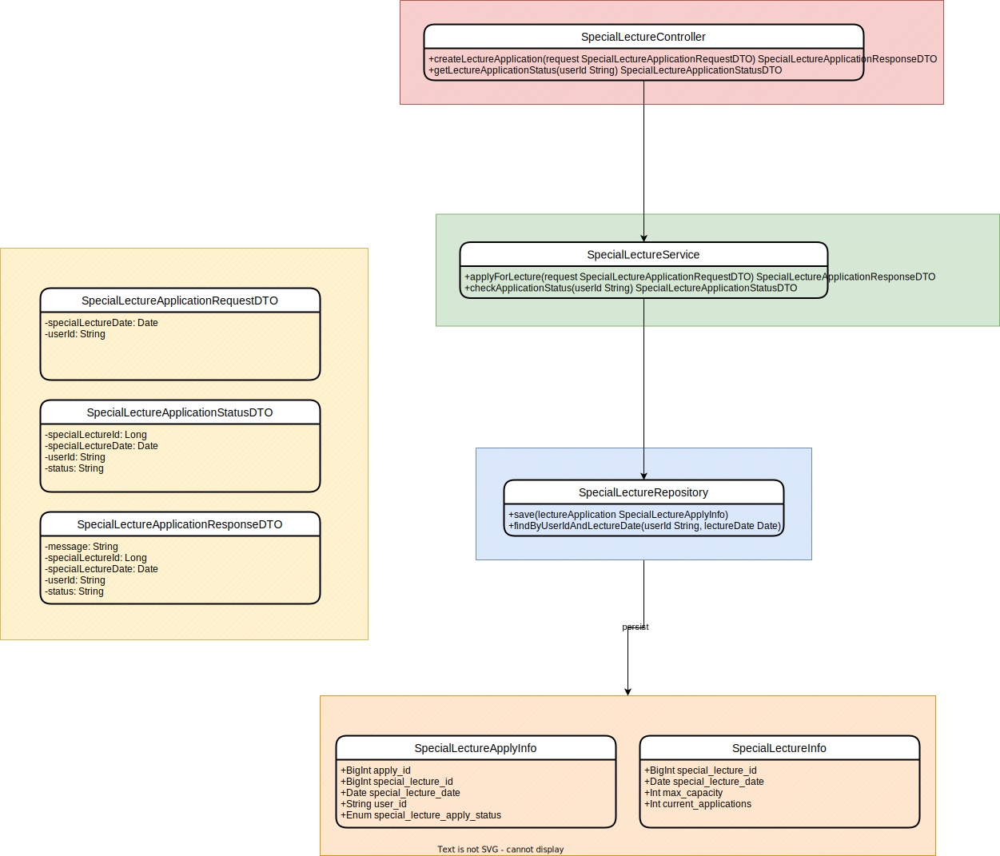

# `특강신청서비스`
## 설명
- 특강을 신청할 수 있는 서비스 개발
- RDBMS를 이용
- 각 기능 및 제약 사항에 대해 단위 테스트를 반드시 하나 이상 작성하도록 합니다.
- 다수의 인스턴스로 어플리케이션이 동작하더라도 기능에 문제가 없도록 작성하도록 합니다.
- 동시성 이슈를 고려하여 구현합니다.

# 요구사항 분석

- 특강선택 신청 API
  - `사용자아이디`와 `선택날짜`로 선착순으로 제공되는 특강을 신청하는 API 를 작성합니다.
  - ~~특강은 `4월 20일 토요일 1시` 에 열리며, 선착순 30명만 신청 가능합니다.~~
  - 신청자는 `날짜별로` 특강을 신청합니다.
  - 신청자는 해당날짜에 특강을 선택해서 특강을 신청할 수 있습니다.
  - 오늘이 지난 특강은 신청이 불가합니다.
  - 선택한날짜에 특강이없으면 신청이 불가합니다.
  - 신청자가 30명 초과라면 신청이 불가합니다.
  - 신청자가 30명 이하라면 특강신청정보에 저장됩니다.
  - 특강신청정보에 특강날짜에 같은 유저아이디가 존재하면 신청이 불가합니다.
  - 특강신청에 문제가 없으면 특강정보에 현재 특강신청수가 1이 더해져 특강정보를 업데이트합니다.

   
- 특강 신청 완료 여부 조회 API
  - 사용자아이디와 특강날짜 로 특강 신청 완료 여부를 조회하는 API 를 작성합니다.
  - 특강 신청에 성공한 사용자는 성공했음을, 특강 등록자 명단에 없는 사용자는 실패했음을 반환합니다.

- 특강목록 조회 API
  - 사용자는 각 특강에 신청하기전 목록을 조회해볼 수 있어야 합니다.

# ERD

- 특강신청정보
  - 특강신청날짜의 유저아이디는 고유하다
- 특강정보
  - 최대정원의 기본값은 30이다.
  - 신청자수의 기본값은 0이다.

- 정확하게 30 명의 사용자에게만 특강을 제공할 방법을 고민해 봅니다.


# DDL
```sql
CREATE TABLE IF NOT EXISTS special_lecture_info (
`id` BIGINT NOT NULL AUTO_INCREMENT COMMENT '내부 인조키',
`special_lecture_id` CHAR(36) NOT NULL COMMENT '특강 ID',
`special_lecture_date` DATE NOT NULL COMMENT '특강 날짜',
`max_capacity` INT NOT NULL DEFAULT 30 COMMENT '최대 정원',
`current_applications` INT NOT NULL DEFAULT 0 COMMENT '현재 신청 수',
PRIMARY KEY (`id`),
UNIQUE KEY `uuid_unique` (`special_lecture_id`),
UNIQUE KEY `unique_date` (`special_lecture_date`)
) ENGINE=InnoDB DEFAULT CHARSET=utf8mb4 COMMENT='특강정보';

CREATE TABLE IF NOT EXISTS special_lecture_apply_info (
`id` BIGINT NOT NULL AUTO_INCREMENT COMMENT '내부 인조키',
`special_lecture_apply_id` CHAR(36) NOT NULL COMMENT '신청 ID',
`special_lecture_id` CHAR(36) NOT NULL COMMENT '특강 ID',
`special_lecture_date` DATE NOT NULL COMMENT '특강 날짜',
`user_id` CHAR(36) NOT NULL COMMENT '사용자 ID, UUID 사용',
UNIQUE KEY `unique_user_per_lecture` (`special_lecture_date`, `user_id`),
PRIMARY KEY (`id`),
UNIQUE KEY `uuid_unique` (`special_lecture_apply_id`),
FOREIGN KEY (`special_lecture_id`) REFERENCES special_lecture_info(`special_lecture_id`)
ON DELETE CASCADE
) ENGINE=InnoDB DEFAULT CHARSET=utf8mb4 COMMENT='특강신청정보';
```

join을 하면 n+1문제가 발생하는데 어떻카지?
@manytoone(fetch=FetchType.LAzY)??
실제쿼리로 해결해야한다.???

null이 값이없는지에체크한다.
메서드 행위확인


# ERD-MYSQL
- DDL
  - 특강신청정보
  - special_lecture_apply_info
```sql
CREATE TABLE IF NOT EXISTS special_lecture_apply_info (
    `special_lecture_apply_id` BIGINT NOT NULL AUTO_INCREMENT COMMENT '인조키',
    `special_lecture_id` BIGINT NOT NULL COMMENT '특강 ID',
    `special_lecture_date` DATE NOT NULL COMMENT '특강 날짜',
    `user_id` VARCHAR(255) NOT NULL COMMENT '사용자 ID',
    `special_lecture_apply_status` ENUM('pending', 'accepted', 'rejected') NOT NULL COMMENT '특강 신청 상태',
    UNIQUE KEY `unique_user_per_lecture` (`special_lecture_date`, `user_id`),
    PRIMARY KEY (`special_lecture_apply_id`),
    FOREIGN KEY (`special_lecture_id`) REFERENCES special_lecture_info(`special_lecture_id`)
    ON DELETE CASCADE
) ENGINE=InnoDB DEFAULT CHARSET=utf8mb4 COMMENT='특강신청정보';
```
- DDL
  - 특강정보
  - special_lecture_info
```sql
CREATE TABLE IF NOT EXISTS special_lecture_info (
    `special_lecture_id` BIGINT NOT NULL AUTO_INCREMENT COMMENT '인조키',
    `special_lecture_date` DATE NOT NULL COMMENT '특강 날짜',
    `max_capacity` INT NOT NULL DEFAULT 30 COMMENT '최대 정원',
    `current_applications` INT NOT NULL DEFAULT 0 COMMENT '현재 신청 수',
    PRIMARY KEY (`special_lecture_id`),
  UNIQUE KEY `unique_date` (`special_lecture_date`)
  ) ENGINE=InnoDB DEFAULT CHARSET=utf8mb4 COMMENT='특강정보';
```
`특강신청서비스`

CompletableFuture 동시성

## 필수사항
- 아래 2가지 API 를 구현합니다.
  - 특강 신청 API
  - 특강 신청 여부 조회 API
- 각 기능 및 제약 사항에 대해 단위 테스트를 반드시 하나 이상 작성하도록 합니다.
- 다수의 인스턴스로 어플리케이션이 동작하더라도 기능에 문제가 없도록 작성하도록 합니다.
- 동시성 이슈를 고려하여 구현합니다.
- 정확하게 30 명의 사용자에게만 특강을 제공할 방법을 고민해 봅니다.
- 같은 사용자에게 여러 번의 특강 슬롯이 제공되지 않도록 제한할 방법을 고민해 봅니다.


# ERD-MYSQL
- DDL
  - 특강신청정보
  - special_lecture_apply_info
```sql
CREATE TABLE IF NOT EXISTS special_lecture_apply_info (
    `special_lecture_apply_id` BIGINT NOT NULL AUTO_INCREMENT COMMENT '인조키',
    `special_lecture_id` BIGINT NOT NULL COMMENT '특강 ID',
    `special_lecture_date` DATE NOT NULL COMMENT '특강 날짜',
    `user_id` VARCHAR(255) NOT NULL COMMENT '사용자 ID',
    `special_lecture_apply_status` ENUM('pending', 'accepted', 'rejected') NOT NULL COMMENT '특강 신청 상태',
    UNIQUE KEY `unique_user_per_lecture` (`special_lecture_date`, `user_id`),
    PRIMARY KEY (`special_lecture_apply_id`),
    FOREIGN KEY (`special_lecture_id`) REFERENCES special_lecture_info(`special_lecture_id`)
    ON DELETE CASCADE
) ENGINE=InnoDB DEFAULT CHARSET=utf8mb4 COMMENT='특강신청정보';
```
- DDL
  - 특강정보
  - special_lecture_info
```sql
CREATE TABLE IF NOT EXISTS special_lecture_info (
    `special_lecture_id` BIGINT NOT NULL AUTO_INCREMENT COMMENT '인조키',
    `special_lecture_date` DATE NOT NULL COMMENT '특강 날짜',
    `max_capacity` INT NOT NULL DEFAULT 30 COMMENT '최대 정원',
    `current_applications` INT NOT NULL DEFAULT 0 COMMENT '현재 신청 수',
    PRIMARY KEY (`special_lecture_id`),
  UNIQUE KEY `unique_date` (`special_lecture_date`)
  ) ENGINE=InnoDB DEFAULT CHARSET=utf8mb4 COMMENT='특강정보';
```


## API 스펙
### 1. 특강 신청 API
- 특강은 userId 로 선착순으로 제공되는 특강을 신청합니다.
- 동일한 신청자는 한번의 수강신청만 성공할 수 있습니다.
- 특강은 `날짜별로`(4월 20일 토요일 1시) 열리며, 선착순 30명만 신청 가능합니다.
- 이미 신청자가 30명이 초과되면 이후 신청자는 요청을 실패합니다.
  Endpoint: /api/special-lectures/apply
  Method: POST
  Request Body:
```json
{
  "special_lecture_date": "YYYY-MM-DD",
  "user_id": "사용자 고유 ID"
}
```
Response:
- 성공시
```json
{
  "message": "신청이 완료되었습니다.",
  "special_lecture_id": "생성된 특강 ID",
  "special_lecture_date": "YYYY-MM-DD",
  "user_id": "사용자 고유 ID",
  "status": "accepted"
}
```
- 30명 초과 신청시
```json
{
  "message": "신청 인원이 초과되었습니다.",
  "status": "rejected"
}
```


### 2. 특강 신청 완료 여부 조회 API
- 특정 userId 로 특강 신청 완료 여부를 조회하는 API 를 작성합니다.
- 특강 신청에 성공한 사용자는 성공했음을, 특강 등록자 명단에 없는 사용자는 실패했음을 반환합니다.
  Endpoint: /api/special-lectures/application-status
  Method: GET

Query Parameters:
- user_id: 사용자 고유 ID
  Response:
- 신청한 경우
```json
{
  "special_lecture_date": "YYYY-MM-DD",
  "user_id": "사용자 고유 ID",
  "special_lecture_apply_status": "accepted"
}
```
- 신청하지 않았거나 신청이 실패한 경우:
```json
{
  "message": "신청한 특강이 없거나 신청이 실패하였습니다.",
  "user_id": "사용자 고유 ID",
  "special_lecture_apply_status": "rejected"
}
```

클래스다이어그램을 그리고 의존성을 적고
클린아키텍쳐를 잘 해야함

api명세명확인,json
클래스다이어그램-의존성

```sql
-- DDL
-- 특강신청정보
-- special_lecture_apply_info
CREATE TABLE IF NOT EXISTS special_lecture_apply_info (
    `special_lecture_apply_id` BIGINT NOT NULL AUTO_INCREMENT COMMENT '인조키',
    `special_lecture_id` BIGINT NOT NULL COMMENT '특강 ID',
    `special_lecture_date` DATE NOT NULL COMMENT '특강 날짜',
    `user_id` VARCHAR(255) NOT NULL COMMENT '사용자 ID',
    UNIQUE KEY `unique_user_per_lecture` (`special_lecture_date`, `user_id`),
    PRIMARY KEY (`special_lecture_apply_id`),
    FOREIGN KEY (`special_lecture_id`) REFERENCES special_lecture_info(`special_lecture_id`)
    ON DELETE CASCADE
) ENGINE=InnoDB DEFAULT CHARSET=utf8mb4 COMMENT='특강신청정보';
```
```sql
-- DDL
-- 특강정보
-- special_lecture_info
CREATE TABLE IF NOT EXISTS special_lecture_info (
    `special_lecture_id` BIGINT NOT NULL AUTO_INCREMENT COMMENT '인조키',
    `special_lecture_date` DATE NOT NULL COMMENT '특강 날짜',
    `max_capacity` INT NOT NULL DEFAULT 30 COMMENT '최대 정원',
    `current_applications` INT NOT NULL DEFAULT 0 COMMENT '현재 신청 수',
    PRIMARY KEY (`special_lecture_id`),
  UNIQUE KEY `unique_date` (`special_lecture_date`)
  ) ENGINE=InnoDB DEFAULT CHARSET=utf8mb4 COMMENT='특강정보';
```


```sql
CREATE TABLE IF NOT EXISTS special_lecture_apply_info (
    `special_lecture_apply_id` BIGINT NOT NULL AUTO_INCREMENT COMMENT '인조키',
    `special_lecture_id` BIGINT NOT NULL COMMENT '특강 ID',
    `special_lecture_date` DATE NOT NULL COMMENT '특강 날짜',
    `user_id` VARCHAR(255) NOT NULL COMMENT '사용자 ID',
    UNIQUE KEY `unique_user_per_lecture` (`special_lecture_date`, `user_id`),
    PRIMARY KEY (`special_lecture_apply_id`),
    FOREIGN KEY (`special_lecture_id`) REFERENCES special_lecture_info(`special_lecture_id`)
    ON DELETE CASCADE
) ENGINE=InnoDB DEFAULT CHARSET=utf8mb4 COMMENT='특강신청정보';
```
- 특강정보 DDL
```sql
CREATE TABLE IF NOT EXISTS special_lecture_info (
    `special_lecture_id` BIGINT NOT NULL AUTO_INCREMENT COMMENT '인조키',
    `special_lecture_date` DATE NOT NULL COMMENT '특강 날짜',
    `max_capacity` INT NOT NULL DEFAULT 30 COMMENT '최대 정원',
    `current_applications` INT NOT NULL DEFAULT 0 COMMENT '현재 신청 수',
    PRIMARY KEY (`special_lecture_id`),
  UNIQUE KEY `unique_date` (`special_lecture_date`)
  ) ENGINE=InnoDB DEFAULT CHARSET=utf8mb4 COMMENT='특강정보';
```





